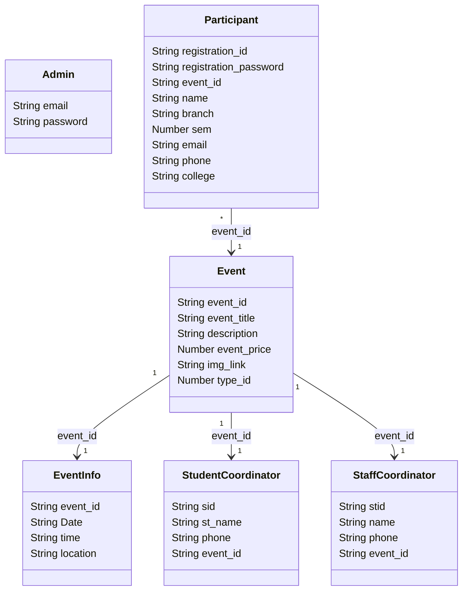

# CampusHub: College Activities Portal Technical Documentation

CampusHub is a responsive college event and activities management platform built on the **MERN (MongoDB, Express.js, React, Node.js) stack**. It is structured as a single cohesive workspace designed to centralize event registrations, scheduling configurations, logistics details, and coordinator outreach.

---

## 📂 Table of Contents
1. [Project Overview & Workflows](#1-project-overview--workflows)
2. [User Interface (UI) Architecture & Layouts](#2-user-interface-ui-architecture--layouts)
3. [Database Schemas (MongoDB Mongoose)](#3-database-schemas-mongodb-mongoose)
4. [API Endpoints Reference](#4-api-endpoints-reference)
5. [Core Data Flows](#5-core-data-flows)

---

## 1. Project Overview & Workflows

CampusHub focuses on a direct **registration-to-lookup** flow, separating public visitor routes from admin dashboards cleanly.

### A. Student (Participant) Flow
1. **Landing Page**: Browses campus event categories (Technical, Gaming, On-Stage, Off-Stage).
2. **Browse Events**: Views event catalog summary cards showing title, date, venue, and a details link.
3. **Event Details Page**: Displays descriptions, fee structures, and coordinator contact details (Student and Staff).
4. **Event Registration Form**: Submits contact details (Name, Email, Phone, College, Branch, Semester) and creates a 4–6 digit/character **Registration Password**.
5. **Registration Success Page**: Displays the dynamic, auto-generated **Registration ID** (e.g. `CH-0001`), Event Name, and Student Name, prompting the student to save their ID and Password securely.
6. **Registered Event Page**: Students enter their Registration ID and Password to check active scheduling details (Student Name, Event Date, Venue, Registration Date, Status). They can click "Cancel Registration" at the bottom to cancel their slot dynamically.

### B. Admin Flow (Protected & Isolated)
1. **Admin Login**: Secure login authenticated against the MongoDB database, generating a secure active session token.
2. **Admin Dashboard**: Real-time metrics showing Total Events, Registrations, Coordinators, and Categories, plus an Event Schedule list.
3. **Admin Event Details Page**: Accessible via `/admin/events/:eventId`, displaying detailed descriptions, dynamic participant counts, and admin action triggers. No student registration options are shown here.
4. **Edit Event Page**: Accessible via `/admin/events/update/:eventId`, allowing pre-filled modifications to titles, fees, categories, coordinates, and images.
5. **Coordinator Directories**: Interactive student/staff lead directories with quick contact update sheets.
6. **Account Settings Page**: Allows the administrator to securely update the admin email and password directly in the database.

---

## 2. User Interface (UI) Architecture & Layouts

CampusHub standardizes spacing, typography (Outfit & Inter fonts), card styles, and buttons using a clean **Indigo primary theme** (`#4f46e5`) with a native **Dark Mode** toggle.

- **Navbar**: Displaying navigation (Home, Events, Registered Event, About Us, Contact Us), Admin Login, and a Sun/Moon theme switch.
- **ProtectedRoute**: React wrapper that checks if `adminToken` and `adminEmail` exist in `localStorage` and validates them against the backend `/api/auth/verify-session` endpoint on mount to safeguard admin pages.
- **Admin Navbar**: Clean dark navigation bar containing admin metrics views, coordinator sheets, account configurations, and logout actions.
- **Theme Variables**: Color styling coordinates with global variables defined in `style.css` (`var(--bg-base)`, `var(--bg-card)`, `var(--text-dark)`, `var(--light-border)`). Toggling the theme switches variables natively.

---

## 3. Database Schemas (MongoDB Mongoose)

The backend runs on a Node + Express API gateway connected to MongoDB. Streamlined models are configured as follows:

- **`Admin`** (Collection: `admins`): Stores credentials securely in the database (Default: `admin@campushub.com` / `admin123`).
- **`Event`** (Collection: `events`): Defines title, price, promotional image, description, and category.
- **`Participant`** (Collection: `participent`): Stores student registrations, including `registration_id` (`CH-XXXX`) and `registration_password` used for cancellations.
- **`StudentCoordinator`** & **`StaffCoordinator`**: Keep track of facilitators for each event.

---

## 4. API Endpoints Reference

### Authentication Endpoints
* **`POST /api/auth/login`**: Verifies login input `{ email, password }` against the database `Admin` collection and returns a session token.
* **`POST /api/auth/verify-session`**: Validates the active session token stored in `localStorage`.
* **`POST /api/auth/logout`**: Clears the active session token.
* **`PUT /api/auth/settings`**: Updates admin email and password in the database.

### Event Endpoints (`/api/events`)
* **`GET /api/events`**: Lists all events. Dynamic participant counts are computed via `Participant.countDocuments`.
* **`GET /api/events/:event_id`**: Fetches a single event's detailed info, including description, coordinator phone numbers, and participant count.
* **`POST /api/events`**: Creates a new event and generates the next incremental event ID (e.g. `CH015`).
* **`PUT /api/events/:event_id`**: Updates event configurations, schedule logistics, and coordinator allocations.
* **`DELETE /api/events/:event_id`**: Deletes the event, associated schedules, coordinators, and all matching registrations.

### Registration Endpoints (`/api/participants`)
* **`POST /api/participants`**: Creates a registration, generates sequential ID `CH-XXXX`, and returns details.
* **`POST /api/participants/verify`**: Validates registration credentials and returns details prior to cancellation.
* **`POST /api/participants/cancel`**: Deletes the registration if credentials match.
* **`GET /api/participants/details`**: Returns all registration records joined with event titles for the admin table.

---

## 5. Core Data Flows

### Student Registration Flow
1. Student clicks **Register Now** on `/events/:eventId`.
2. Student submits form details and a registration password.
3. Express server calculates next registration ID (e.g. `CH-0010`) and saves the record in the `participants` collection.
4. Success page loads at `/success/:regId`, displaying the registration card and a warning to save the password.

### Admin Session Verification
1. Admin enters credentials at `/login`.
2. Server verifies the password, generates a random session token in-memory, and returns it to the client.
3. Client stores the token and email in `localStorage` and routes the admin to `/admin`.
4. On route change, the React `ProtectedRoute` wrapper submits `{ email, token }` to `/api/auth/verify-session`.
5. If the backend verifies it, dashboard contents render; if the handshake fails (e.g. key tampering), the client wipes storage and drops the user to `/login`.
